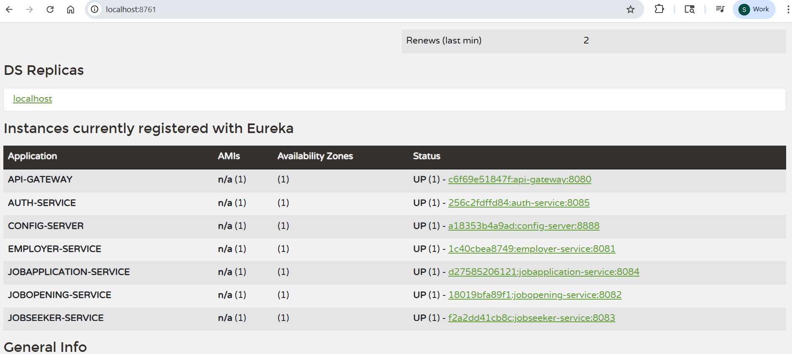

./gradlew bootJar

gradlew.bat clean
gradlew.bat build

docker-compose build
docker-compose up 

docker ps -a -f status=exited

docker-compose down

git bash only docker rmi -f $(docker images -q)

docker system prune -a

docker exec -it <container_name_or_id> bash
docker exec -it <container_name_or_id> sh

docker exec -it dreamjobapp-api-gateway-1 bash

gradlew,bat :api-gateway:bootRun --args='--spring.profiles.active=dev'

https://github.com/sagarmahapatro/DreamJobApp.git

https://github.com/sagarmahapatro/dreamjob-config-repo.git

http://localhost:8080/employers/ping
http://localhost:8080/auth/ping
http://localhost:8080/job-applications/ping
http://localhost:8080/job-openings/ping
http://localhost:8080/job-seekers/ping

Employer Deletion Saga Flow
Steps:

Delete Employer in Employer Service.

Delete Jobs posted by that employer in JobOpening Service.

Delete Applications for those jobs in Application Service.

Compensating Actions:

If job deletion fails → restore Employer record.

If application deletion fails → restore Jobs or mark Employer as "DELETION_PENDING".

Circuit Breaker:

Wrap each remote service call (Jobs + Applications) so if they’re unavailable → fallback marks state "PENDING".